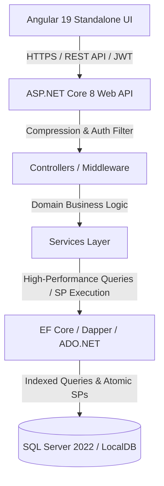

# 🚀 WorkFlow Pro - Enterprise Team & Task Management System

[](https://github.com/pra2011shant/TaskmgmtSystem/actions/workflows/ci.yml)
[](https://dotnet.microsoft.com/)
[](https://angular.dev/)
[](https://www.microsoft.com/sql-server)
[](LICENSE)

A high-performance, enterprise-grade full-stack **Team & Task Management System** engineered with **ASP.NET Core 8 Web API**, **Entity Framework Core 8**, **Microsoft SQL Server (with Optimized Stored Procedures)**, and **Angular 19 Standalone Components & Signals**.

---

## 🏛️ System Architecture



---

## 🌟 Key Features

### 1. Role-Based Access Control (RBAC)
* 👑 **Admin**: Complete system visibility, manage user directory, assign team leaders, configure tracking remarks, and oversee all system records.
* 👔 **Manager**: Department management, create and assign tasks, track timelines, manage team membership, and monitor team KPIs.
* 👤 **User (Employee/Member)**: Task execution, status transitions (`To Do` ➔ `In Progress` ➔ `Done`), task comments/discussions, personal notifications.

### 2. Modular Frontend (Angular 19)
* 🧩 **Modular UI Components**: Reusable `StatCardComponent`, `StatusBadgeComponent`, `SkeletonLoaderComponent`, `EmptyStateComponent`.
* ⚡ **Ultra-Fast Reactivity**: Built with Angular Signals for zero-delay state updates and optimized change detection.
* 🎨 **Glassmorphism & Micro-animations**: Premium dark/light accents, dynamic badges, shimmer skeleton loaders, smooth Kanban drag interactions.
* 📊 **Kanban & Table Views**: One-click toggle between Kanban status board and structured tabular directory with multi-field search and filters.
* 📅 **Timeline Schedule (`/schedule`)**: Date-grouped deliverable tracking, previous/next day timeline stepping, and user filtering.

### 3. High-Performance Backend & Database
* 🗜️ **Response Compression**: Brotli and Gzip middleware for minimal network payloads and rapid response times.
* ⚡ **Optimized Stored Procedures**: `SET NOCOUNT ON;`, `SET XACT_ABORT ON;`, atomic transaction handling, and parameterized query execution.
* 🔍 **Database Indexing**: Non-clustered performance indexes on foreign keys, status fields, and lookup columns (`IX_Tasks_Status_DueDate`, `IX_Tasks_AssignedToUserId`, `IX_Notifications_UserId_IsRead`).

---

## 🔑 Pre-Configured Demo Credentials

The database auto-seeds these accounts on first startup:

| Role | Email | Password | Access Level |
|---|---|---|---|
| **Admin** | `admin@system.com` | `Admin@123` | Full administrative oversight & audit fields |
| **Manager** | `manager@system.com` | `Manager@123` | Team leadership & task delegation |
| **User (Developer)** | `rahul@system.com` | `User@123` | Task execution & status updates |
| **User (Designer)** | `priya@system.com` | `User@123` | Task execution & status updates |
| **User (QA)** | `user@system.com` | `User@123` | Task execution & status updates |

---

## 🛠️ Technology Stack

* **Backend Web API**: ASP.NET Core 8.0, C# 12
* **ORM & Database**: Entity Framework Core 8.0, Microsoft SQL Server 2022
* **Authentication**: JWT Bearer Tokens, BCrypt salted cryptographic hashing
* **Frontend**: Angular 19 (Standalone Components, Signals, Reactive Forms)
* **Styling**: CSS3 Design System, Glassmorphism, Micro-animations, FontAwesome
* **Testing**: xUnit, Moq, FluentAssertions
* **CI/CD & DevOps**: GitHub Actions, Docker, Docker Compose

---

## 🚀 Quick Start Guide

### Prerequisites
* [.NET 8 SDK](https://dotnet.microsoft.com/download/dotnet/8.0)
* [Node.js](https://nodejs.org/) (v18 or higher)
* [SQL Server](https://www.microsoft.com/sql-server/) (or LocalDB / SQL Express)

### Step 1: Run Backend API
```bash
cd Backend/ManagementSystem
dotnet run
```
* API Server: `http://localhost:5000`
* Swagger OpenAPI: `http://localhost:5000/swagger`

### Step 2: Run Frontend UI
```bash
cd Frontend/ManagementSystemUI
npm install
npm start
```
* Web Application: `http://localhost:4200`

---

## 🐳 Docker Multi-Container Setup

To launch SQL Server, Backend API, and Frontend UI simultaneously:

```bash
docker-compose up --build
```

---

## 🧪 Testing & Quality Assurance

### Run Backend Unit Tests
```bash
dotnet test Backend/ManagementSystem.Tests/ManagementSystem.Tests.csproj
```

### Run Frontend Production Build
```bash
cd Frontend/ManagementSystemUI
npm run build
```

---

## 📜 License
This project is open-source and licensed under the [MIT License](LICENSE).
