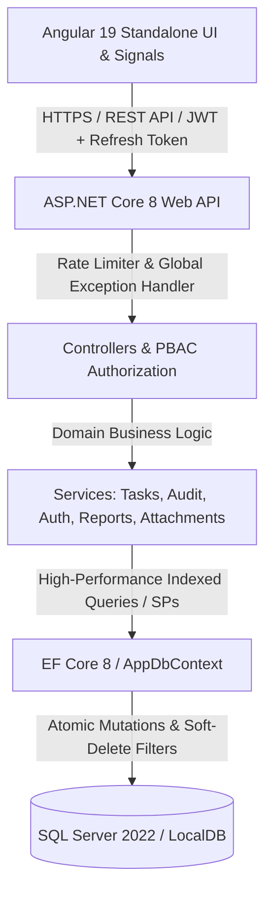

# 🚀 WorkFlow Pro — Enterprise Task & Team Management System

[](https://github.com/pra2011shant/TaskmgmtSystem/actions/workflows/ci.yml)
[](https://dotnet.microsoft.com/)
[](https://angular.dev/)
[](https://www.microsoft.com/sql-server)
[](LICENSE)

A high-performance, enterprise-grade full-stack **Task & Team Management System** built with **ASP.NET Core 8 Web API**, **Entity Framework Core 8**, **Microsoft SQL Server (with Stored Procedures & Indexes)**, and **Angular 19 Standalone Components & Signals**.

---

## 🏛️ System Architecture



---

## 🌟 Enterprise Feature Matrix

| # | Feature | Details & Implementation |
|---|---|---|
| 1 | 📁 **Projects & Milestones** | High-level project containers, deliverable milestone roadmaps, budget allocation, completion percentages |
| 2 | ⏱️ **Live Stopwatch Time Tracker** | Active running ticker in navbar, start/stop stopwatch sessions, task manual work hours logging |
| 3 | 🏆 **Productivity Leaderboard** | Gamified podium rankings (*Gold, Silver, Bronze*), streaks, points formula, achievement badges |
| 4 | ⚡ **Real-Time SignalR Hub** | Instant WebSocket synchronization for task updates, status changes, and threaded discussions (`/hubs/tasks`) |
| 5 | 🌓 **Dark / Light Mode Themes** | Premium curated themes with smooth transitions and persistent browser storage |
| 6 | 📦 **Bulk Batch Operations** | Multi-select task batch status updates, mass reassignment, priority modification, and soft deletion |
| 7 | 🗄️ **Master SQL Database Script** | Single consolidated `database_master.sql` containing 18 tables, indexes, stored procedures, and full dummy data |
| 8 | 🚀 **Advanced Task Management** | Priority (*Low, Medium, High, Critical*), Due Dates, Categories, Tags, Estimated vs Actual Hours, Subtasks checklist |
| 9 | 📊 **Advanced Dashboard** | KPI metric counters (*Total, Completed, In Progress, Overdue, Pending*), distribution breakdown charts, recent activity stream |
| 10 | 🔔 **Advanced Notification System** | Lifecycle triggers (*Task assigned, Reassigned, Status changed, @mentions, Overdue*), Notification Center & badge count |
| 11 | 💬 **Better Collaboration** | Threaded comments, edit/delete own comments, `@username` auto-mentions, activity timeline |
| 12 | 👥 **Better Team Management** | Department cards, member roster, team leads, capacity balancing, team-wise tasks |
| 13 | 🔐 **Strong Security** | JWT Access Token + Refresh Token rotation, PBKDF2/BCrypt hashing, Account lockout (5 failed attempts), Rate limiting, Global Exception middleware |
| 14 | 📝 **Audit Log System** | Comprehensive entity mutation tracking, Old vs New JSON diff inspection, IP address logging, timestamping |
| 15 | 📎 **File Attachments** | Multi-file upload, download streaming, and deletion for PDF, Excel, PNG/JPG images |
| 16 | 🔄 **Task Workflow** | Multi-stage lifecycle (*Created $\rightarrow$ Assigned $\rightarrow$ To Do $\rightarrow$ In Progress $\rightarrow$ Review $\rightarrow$ Done / Blocked / Cancelled*) |
| 17 | 🧑‍💼 **Admin Control Center** | Dedicated admin panel with Users, Teams, Permissions Matrix, System Telemetry, and Audit Logs Explorer |
| 18 | 🛡️ **Permission Management** | Granular PBAC (`Task.Create`, `Task.Delete`, `Team.Manage`, `Audit.View`, `Reports.Export`), Angular `*hasPermission` directive |
| 19 | 📅 **Calendar View** | Interactive month grid & week planner with clickable task badges, priority color coding, and quick-create day slots |
| 20 | 📋 **Kanban Board** | Smooth drag-and-drop cards across workflow columns with optimistic UI updates |
| 21 | 📈 **Reports & Export Engine** | User productivity telemetry, Team velocity stats, Overdue SLA list, 1-click Export to **CSV**, **Excel**, and **Printable PDF/HTML** |
| 22 | 🔎 **Global Universal Search** | Spotlight modal search (`Ctrl + K`) across Tasks, Users, and Teams with instant deep links |
| 23 | ⚡ **Performance Optimization** | Async/await throughout, response compression (Brotli/Gzip), DB non-clustered indexing, query projection |
| 24 | 🧪 **Comprehensive Testing** | Unit tests for PasswordHasher, JwtHelper, Permissions, and Task item models via xUnit |
| 25 | 🐳 **Docker Multi-Container** | Multi-container deployment for SQL Server, ASP.NET Core Web API, and Angular Frontend via Docker Compose |
| 26 | 🔄 **CI/CD Pipeline** | GitHub Actions workflow (`.github/workflows/ci.yml`) for automated build, test validation, and compilation |

---

## 🔑 Pre-Configured Demo Accounts

| Role | Email | Password | Scope |
|---|---|---|---|
| **Admin** | `admin@system.com` | `Admin@123` | Full system governance, permissions, user provisioning & audit logs |
| **Manager** | `manager@system.com` | `Manager@123` | Team management, task creation/assignment, velocity reports |
| **User (Developer)** | `rahul@system.com` | `User@123` | Task execution, Kanban progression, subtasks & comments |
| **User (Designer)** | `priya@system.com` | `User@123` | UI/UX deliverables, attachments & review stage |
| **User (QA)** | `user@system.com` | `User@123` | QA testing, test automation, review verification |

---

## 🛠️ Technology Stack

* **Backend API**: ASP.NET Core 8.0, C# 12
* **ORM & Database**: Entity Framework Core 8.0, Microsoft SQL Server 2022 (with Stored Procedures)
* **Authentication & Security**: JWT Bearer + Refresh Token rotation, RateLimiter middleware, Exception handler middleware
* **Frontend**: Angular 19 (Standalone Components, Signals, Reactive Directives)
* **Styling**: Modern CSS3 Glassmorphism, Micro-animations, FontAwesome
* **Testing**: xUnit, Moq, FluentAssertions
* **CI/CD & DevOps**: GitHub Actions, Docker, Docker Compose

---

## 🚀 Quick Start Guide

### Step 1: Run Backend API
```bash
cd Backend/ManagementSystem
dotnet run
```
* API Server: `http://localhost:5000`
* Swagger OpenAPI: `http://localhost:5000/swagger`

### Step 2: Run Frontend UI
```bash
cd Frontend/ManagementSystemUI
npm install
npm start
```
* Web Application: `http://localhost:4200`

---

## 🐳 Docker Launch
```bash
docker-compose up -d --build
```
* Angular UI: `http://localhost:4200`
* Web API: `http://localhost:5000`
* SQL Server: `localhost:1433`

---

## 📄 License
Distributed under the MIT License. Built with ❤️ for enterprise engineering assessments.
